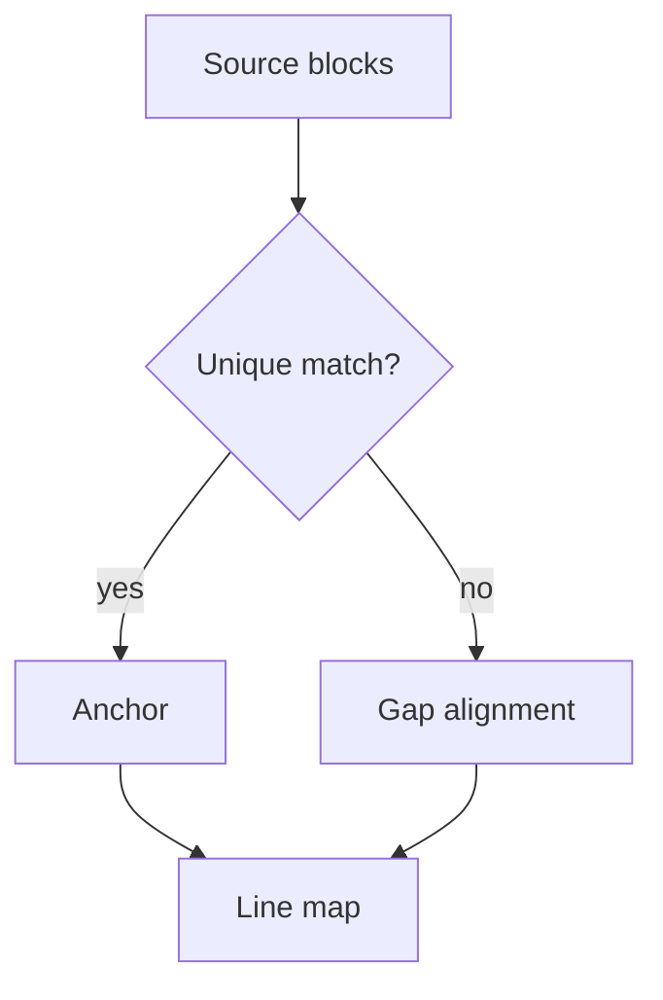
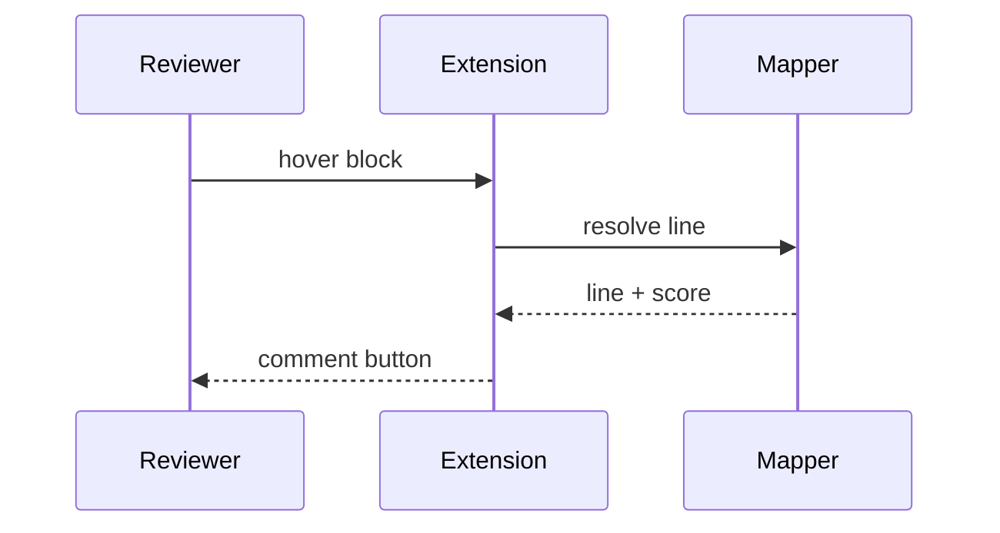

# RFC-004: GitHub Extensions

Constructs below are GitHub additions on top of CommonMark. Several of them
render into DOM shapes that share no structure with their source form.

## Alerts

> [!NOTE]
> Useful information that users should know, even when skimming content.

> [!TIP]
> Helpful advice for doing things better or more easily.

> [!IMPORTANT]
> Key information users need to know to achieve their goal.

> [!WARNING]
> Urgent info that needs immediate user attention to avoid problems.

> [!CAUTION]
> Advises about risks or negative outcomes of certain actions.

An alert whose body wraps across several source lines:

> [!NOTE]
> The body of an alert follows the same continuation rules as any other
> blockquote, so a wrapped alert body spans several source lines and renders as
> one paragraph inside a styled container.

A plain blockquote directly after an alert, to check that the alert marker does
not leak into the next block:

> An ordinary quote with no alert marker.

## Footnotes

A statement that needs a citation.[^first] Another statement with a different
citation.[^second] A third reference reuses the first footnote.[^first]

A footnote with a longer identifier.[^long-identifier-here]

[^first]: The first footnote body.
[^second]: The second footnote body, which wraps across more than one source
    line to check continuation handling.
[^long-identifier-here]: A footnote whose identifier is not a number.

## Emoji

Shortcodes render as images with alt text: :tada: :warning: :rocket: :bug:

A line mixing emoji with prose: shipping this :rocket: should close the issue.

Unicode emoji pass through unchanged: 🎉 ⚠️ 🚀 🐛

## Autolinked references

An issue reference: #1

A commit SHA reference: d293271

A username-style handle that does not resolve: @fixture-bot-placeholder

A cross-repository reference: example-org/example-repo#42

## Collapsible sections

<details>
<summary>Click to expand the implementation notes</summary>

Content inside a details element is markdown, but it needs a blank line after
the summary tag to be parsed as markdown rather than raw HTML.

- A list inside the collapsible section
- A second item

```ts
const insideDetails = true;
```

</details>

<details>
<summary>A second collapsible section</summary>

Body of the second section.

</details>

## Inline HTML

Text with <kbd>Ctrl</kbd> + <kbd>C</kbd> keyboard elements.

Text with a <sup>superscript</sup> and a <sub>subscript</sub>.

Text with an <abbr title="Request For Comments">RFC</abbr> abbreviation.

Text with <mark>highlighted content</mark> inline.

A raw <br> break tag followed by more text.

## HTML blocks

<div align="center">
  <strong>Centred block content</strong>
</div>

<table>
  <tr><th>Raw HTML header</th></tr>
  <tr><td>Raw HTML cell</td></tr>
</table>

<!-- An HTML comment that renders to nothing at all. -->

## Math

Inline math: $E = mc^2$ appears within a sentence.

A display block:

$$
\sum_{i=1}^{n} w_i \cdot s_i
$$

A fenced math block:

```math
\frac{a}{b} + \frac{c}{d}
```

## Mermaid





## Badges and images in prose

A paragraph containing a badge image [](https://example.com/ci)
inline with surrounding text.

## Line breaks inside table cells

| Construct | Description |
|---|---|
| Break | First line<br>Second line |
| List | <ul><li>one</li><li>two</li></ul> |
